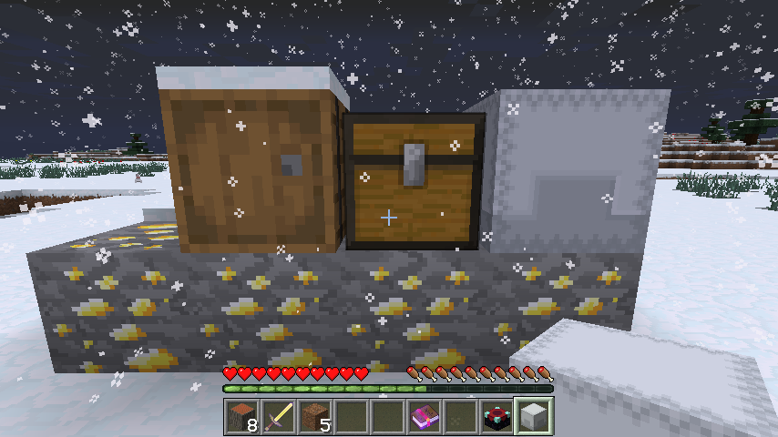
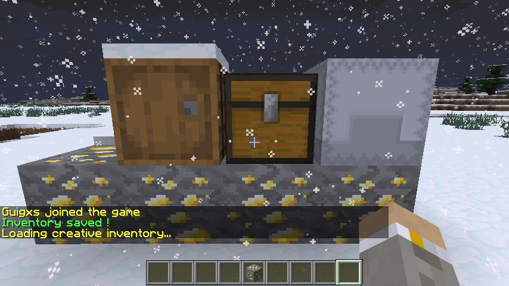
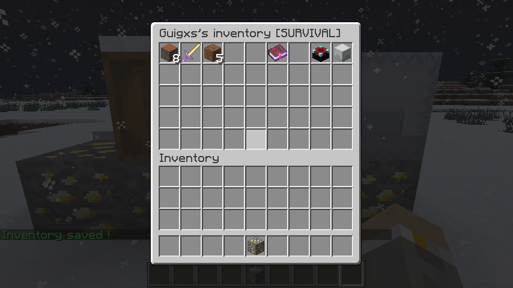

# Quick-Inventory - 

This is a simple plugin that helps you to manage players' gamemode inventories.
## Installation:

1. Download the file from [Bukkit project](https://dev.bukkit.org/projects/quick-inventory) and place it in your plugins directory.
2. Reload or restart your server.
3. Have a fun :)

## Usage:

- /gmi [optional:player] [optional:gamemode] : change the gamemode and the inventory.
- /qi see [player] [gamemode] : see the player's gamemode inventory.
- /qi clear [player] [gamemode] : clean the player's gamemode inventory.
- /qi help or ? : open help menu.

## Permissions:

- quickInv.gmi : allows access to gmi command.
- quickinv.qi : allows acces to qi commands.

## Screenshots

___

The players' inventories are saved in : `/plugins/QuickInventory/inventories.yml`

If you have any questions or suggestions please let me know.

 